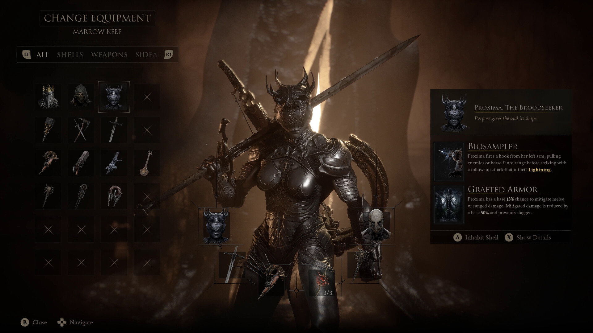
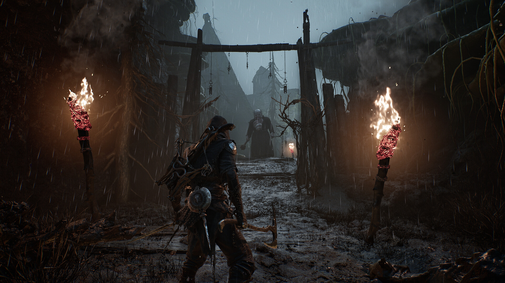

# Mortal Shell 2 Shell Build Toolkit

Mortal Shell II build tools for PC with Shell progression controls, Glimpse and Tarcore values, respec planning and boss practice. Compare builds and tune assistance without rebuilding your entire setup for each attempt.

---

## Download

---

## Game Gallery

 

## Features

| Feature | What it does |
|---|---|
| **Shell progression** | Adjust development values for the Shell you are using. |
| **Respec planning** | Compare resource requirements and prepare alternative Shell configurations. |
| **Glimpses and Tarcores** | Set resource values for Shell and Tarstone progression. |
| **Boss practice** | Use saved encounter profiles with adjustable damage assistance. |
| **Combat pacing** | Change practice speed to work on attack and defensive timing. |
| **Build profiles** | Keep separate weapon, resource and assistance configurations for your builds. |

## Profiles

Prepare two Shell builds, assign the resource values and save each configuration. Compare them in a boss encounter and keep the setup that fits your timing.

## Getting Started

1. Open the **Download** link above.
2. Download the PC package and follow the included setup instructions.
3. Launch Mortal Shell II and open the application.
4. Select the game profile and the options you want to use.
5. Save your configuration for the next session.

## Project Information

| Item | Details |
|---|---|
| Game | Mortal Shell II |
| Platform | Windows / PC |
| Focus | Shell builds / Respec / Glimpses / Tarcores / Tarstones / Boss practice |
| Download | [PC package](https://flyn.im/6PCpxq) |

## FAQ

<strong>What does this toolkit include?</strong>

Shell progression, Respec planning, Glimpses and Tarcores, Boss practice, Combat pacing, Build profiles.

<strong>Where can I download the application?</strong>

Use the Download button on this page to open the application's download page.

## Quick Download

---

Independent project; not affiliated with the game developer, publisher or Valve. Gallery images depict the game. See [image credits](assets/CREDITS.md), [sources](SOURCES.md) and the [license](LICENSE).
                                                                                                    